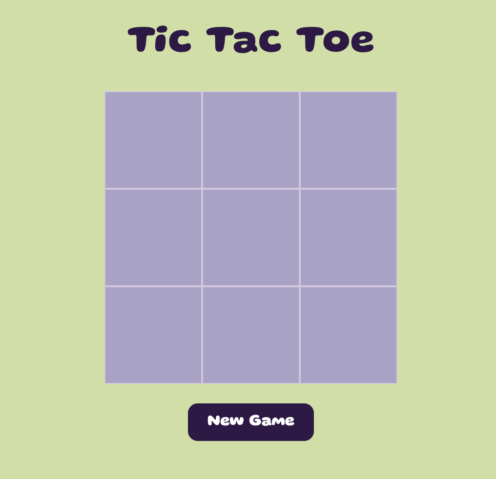
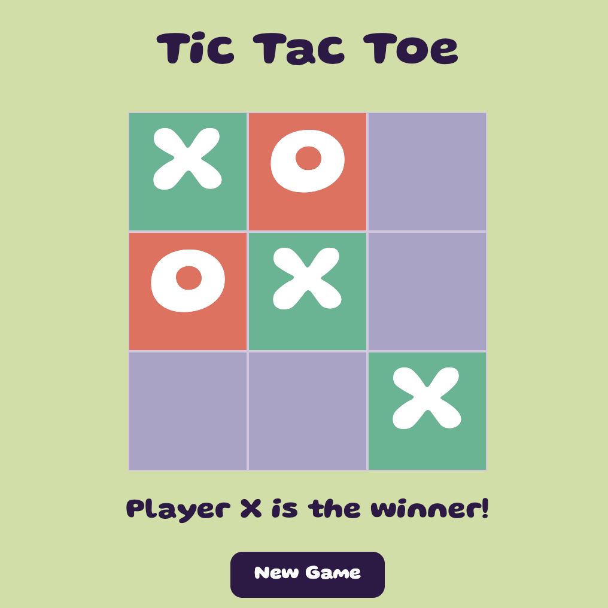

# Tic Tac Toe Game

This application is a two-player Tic-Tac-Toe game where users can take turns placing their "X" or "O" on a grid. The game automatically detects a win and displays a congratulatory message in the DOM. Built with object-oriented programming principles, this project offers a clean, modular, and scalable codebase.

Link to project: https://color-tic-tac-toe.netlify.app/

## Features

- **Two-Player Gameplay:** Players alternate turns to place "X" or "O" on the board.
- **Interactive UI:** Users click directly on the grid to make their moves.
- **Win Detection:** Automatically identifies a win and announces it on the screen.
- **OOP Design:** Game logic and components are organized using object-oriented programming for maintainability and reusability.

## Technology Used

- HTML
- CSS
- JavaScript

## Screenshots

  
  

